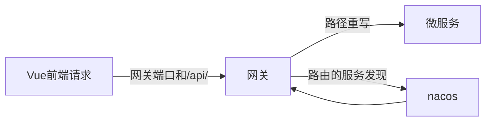
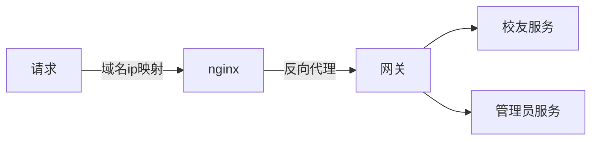
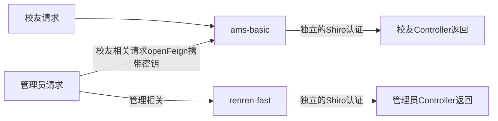

# AlumniManagementSystem
## 校友管理系统-后端 ams-backend

#### 更新日期：2024/5/10

### 快速开始

- 由于项目已部署，所以如非修改，请直接使用部署好的项目

- 如果需要修改代码，请按以下步骤进行：（同时注意不要与部署好的项目有冲突）

  - 确保服务器上（无论是学校的还是实验室的）启动了 MySQL, Redis, Nacos

  - Fork或克隆项目到本地，并在配置文件中配置 MySQL, Redis, Nacos 的连接信息

  - 在IDEA中分别启动：
    - ams-gateway
    - ams-basic
    - renren-fast

  - 启动前端，见 https://github.com/Serendipity-Huan/ams-front
  - 全部启动成功后，可从前端访问，测试功能是否正常，然后可按需修改代码
  - 修改完成后如需更新部署，务必切换为生产环境，其他细节请参见基本说明文档

### 开发/生产环境配置切换

==打包部署时请一定要切换成生产环境：==

- 更改 ams-gateway, ams-basic, renren-fast 中：
  - bootstrap.properties 文件的 nacos 配置
- 更改 ams-basic, renren-fast 中：
  - application-dev.yml 和 application-prod.yml 文件中 MySQL, Redis和mail等配置
  - application.yml 文件中 spring.profiles.active （prod为生产，dev为开发）

### 流程介绍

- 开发环境的请求流程：

- 生产环境的请求流程：（相比于开发环境，只是额外多了域名解析和nginx反向代理）

- 校友服务和管理服务的调用方案：

### 主要模块

ams-gateway（需要启动）9000端口
>- 网关，负责请求过滤和转发

ams-basic（需要启动）8000端口
>- 校友服务，负责校友用户的操作

renren-fast（需要启动）8080端口
>- 管理服务，负责管理员用户的操作

ams-common

>- 负责管理所有微服务公共的依赖, bean, 工具类，一般无需更改

renren-generator
>- 开发前期使用的MySQL到Java对象的逆向工程, 可忽略

### 技术栈 

- 技术栈：Spring Boot, MySQL, MyBatis-Plus, Redis, Apache Shiro, Nacos, OpenFeign, Gateway

  - Apache Shiro 是身份认证和鉴权框架

  - Nacos是服务注册中心和配置中心

  - OpenFeign用于管理服务向校友服务发送请求（采用HTTP而非RPC）

  - Gateway是网关，负责过滤并转发请求到对应的服务

>- Java version: 1.8.0_201 / 1.8.0
>- Maven version: 3.6.1
>- MySQL 5.7
>- redis 6.2.6 / 7.2.3
>- nacos 1.4.2
